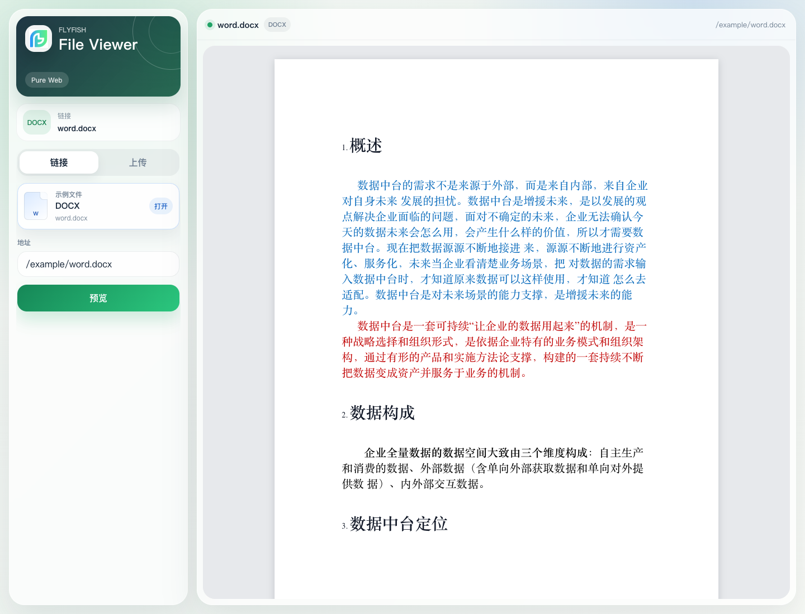
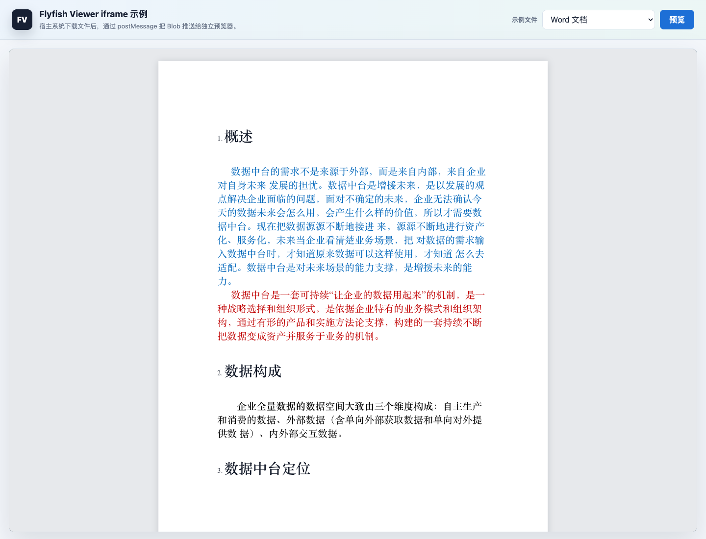
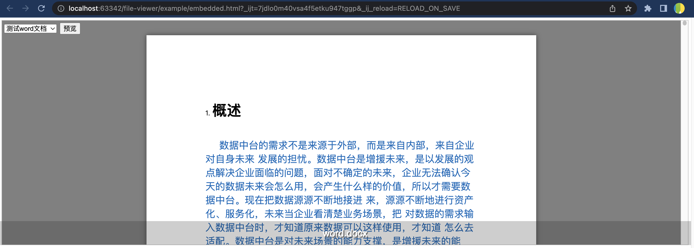

# Flyfish Viewer

[Simplified Chinese](README.md) | [English](README.en.md)

Bring Word, Excel, PowerPoint, PDF, Typst, archives, email, audio/video, ebooks, drawings, CAD, geospatial data, 3D models, Markdown, images, fonts, design assets, structured data, and source code preview into the browser with a clean, deployable viewer.

`@file-viewer/core` provides the low-level preview capabilities, format matrix, lifecycle events, and operation APIs. Independent renderer packages such as `@file-viewer/pptx` own heavy format engines that can evolve separately. Vue 3, Vue 2.7, Vue 2.6, React, React Legacy, Pure Web, jQuery, and Svelte standard component packages provide native component experiences, type exports, and ecosystem-specific interaction layers on top of the same foundation. New integrations should prefer the standard `@file-viewer/*` package names; historical `@flyfish-group/*` package names remain synchronized.

The viewer does not require a backend conversion service. It is designed for OA systems, knowledge bases, attachment centers, workflow platforms, customer support portals, document approval flows, intranet systems, and offline-capable deployments where file preview should feel like a maintained product module rather than a temporary feature.

- Standard npm packages: `@file-viewer/core`, `@file-viewer/pptx`, `@file-viewer/vue3`, `@file-viewer/vue2.7`, `@file-viewer/vue2.6`, `@file-viewer/react`, `@file-viewer/react-legacy`, `@file-viewer/web`, `@file-viewer/jquery`, `@file-viewer/svelte`
- Historical compatibility packages: `@flyfish-group/file-viewer3`, `file-viewer3`, `@flyfish-group/file-viewer`, `@flyfish-group/file-viewer-react`, `@flyfish-group/file-viewer-web`
- Official website: [file-viewer.app](https://file-viewer.app)
- Official documentation: [doc.file-viewer.app](https://doc.file-viewer.app)
- Ecosystem integration guide: [doc.file-viewer.app/guide/ecosystem](https://doc.file-viewer.app/guide/ecosystem)
- Online demo: [demo.file-viewer.app](https://demo.file-viewer.app)
- Document comparison demo: [demo.file-viewer.app/compare.html](https://demo.file-viewer.app/compare.html)
- Release downloads: [github.com/flyfish-dev/file-viewer/releases](https://github.com/flyfish-dev/file-viewer/releases)
- GitHub open-source main repository: [github.com/flyfish-dev/file-viewer](https://github.com/flyfish-dev/file-viewer)
- Gitee open-source main mirror: [gitee.com/flyfish-dev/file-viewer](https://gitee.com/flyfish-dev/file-viewer)
- Sponsorship and priority support: [https://dev.flyfish.group/shop](https://dev.flyfish.group/shop)

## Why Use It

- **Pure frontend and serverless.** File parsing and rendering happen in the browser. You do not need Office Server, a LibreOffice daemon, or a document conversion backend.
- **Broad format coverage.** The current release maps 194 extensions across 23 preview pipelines, including Office, PDF, OFD, Typst, archives, email, EDA files, CAD, geospatial data, 3D models, Excalidraw, draw.io, EPUB, UMD, Markdown, images, audio/video, source code, fonts, design assets, and structured data.
- **Lazy loaded renderers.** Heavy PDF, Office, OFD, Typst, archive, email, CAD, geospatial, 3D, ebook, Markdown, HLS, HEIC, data-asset, and code highlighting dependencies are loaded only when the file type needs them.
- **Production-ready operations.** The viewer includes original file download, full rendered printing, rendered HTML export, watermark options, theme options, lifecycle hooks, native event callbacks, and before-operation guards for permission checks.
- **Better document reading.** Word and PDF keep a grey workspace, white paper surface, centered reading, width fitting, navigation, zoom, rotation, and complete print / HTML export paths.
- **Renderer-native zoom controls.** The common toolbar can zoom in, zoom out, and reset through per-format providers for PDF, Word, PPTX, virtual Excel tables, images, CAD, OFD, Typst, Markdown, code, and drawing files, avoiding fragile host-level CSS transforms.
- **Controlled theming.** `options.theme` supports `light`, `dark`, and `system`. Light business UIs can lock the viewer to `light` even when the operating system is in dark mode.
- **PDF toolbar ergonomics.** `toolbar.position` supports `auto`, `top`, and `bottom-right`. In `auto` mode, PDF uses a bottom-right floating operation bar to avoid duplicating the PDF navigation toolbar.
- **Demo and comparison views.** The repository includes the main demo and a standalone `/compare.html` page for side-by-side document comparison.
- **Consistent native component package experience.** Core focuses on preview capabilities while Vue 3, Vue 2, React, vanilla JavaScript, jQuery, and Svelte standard component packages expose the same option, event, search, zoom, print, and export semantics in each ecosystem.
- **Open-source main distribution.** The open-source main repository contains core, standalone renderer packages, standard component packages, compatibility packages, the runnable main demo source, documentation source, minified build artifacts, sample files, Docker deployment assets, npm tarballs, and release downloads. The private Gitea aggregate remains valuable for the complete workspace, unified release automation, sponsorship, and priority support.

## Supported Formats

The viewer is organized around preview pipelines rather than one-off file extensions.

| Category | Extensions | Rendering pipeline | Typical use |
| --- | --- | --- | --- |
| Word | `docx`, `docm`, `dotx`, `dotm` | Self-maintained `@file-viewer/docx` with Worker parsing, continuous flow reading, cached TOC fields, async rendering, print, and HTML export; visual pagination is opt-in | Modern Word documents and templates |
| Legacy Word | `doc`, `dot` | `msdoc-viewer` with Word-like paper surface and CFB tolerance fixes | Old Word 97-2003 files |
| Compatible documents | `rtf`, `odt` | RTFJS or OpenDocument package parsing with a paper-like reading surface | RTF exports and OpenDocument text documents |
| Excel | `xlsx`, `xltx` | `styled-exceljs` with virtual table rendering, merged cells, styles, auto text color, workbook images, fidelity-first main-thread parsing by default, and an explicit opt-in static Worker | Business spreadsheets and templates |
| Excel-compatible | `xlsm`, `xlsb`, `xls`, `xlt`, `xltm`, `csv`, `ods`, `fods`, `numbers` | Progressive spreadsheet parsing and virtual rendering through the same default main-thread path, with Worker opt-in when deployment allows it | Legacy spreadsheets and lightweight data preview |
| PowerPoint | `pptx`, `pptm`, `potx`, `potm`, `ppsx`, `ppsm`, `odp` | Native open-source `@file-viewer/pptx` engine with Worker based progressive slide output; ODP uses OpenDocument slide text extraction | Presentations, training decks, proposals |
| PDF | `pdf` | `pdfjs-dist`, streaming same-origin loading, Range support, zoom, rotation, page thumbnails, outline tree, width fitting, print, HTML export | Contracts, invoices, official layout documents |
| OFD | `ofd` | Browser-side OFD preview based on `DLTech21/ofd.js` source | Chinese e-invoices, government documents, archives |
| Typst | `typ`, `typst` | Direct Typst source rendering with browser WASM compiler and SVG pages | Technical reports, papers, engineering documents |
| Archives | `zip`, `zipx`, `7z`, `rar`, `tar`, `gz`, `tgz`, `bz2`, `xz`, `zst`, `cab`, `iso`, `jar`, `apk`, `cbz`, `cbr`, and more | Shared core archive renderer with a `libarchive.js` Worker, directory listing, lazy extraction, nested preview, IndexedDB cache, and ZIP/TAR/GZIP fallback | Attachment packages and internal document bundles |
| Email | `eml`, `msg`, `mbox` | `postal-mime` for EML/MBOX, `@kenjiuno/msgreader` for MSG, headers, HTML/text body, attachment preview | Email archives and support tickets |
| EDA | `olb`, `dra` | CFB-based OrCAD / Allegro structure inspection, trees, symbols, footprints, padstack candidates, properties, strings, diagnostics | Component libraries and EDA attachments |
| CAD | `dwg`, `dxf`, `dwf`, `dwfx`, `xps` | `@flyfish-dev/cad-viewer` preview. DWG uses Worker + LibreDWG WASM, DXF uses a JS parser, and DWF/DWFx/XPS use the native `dwf-viewer` path for W2D/W3D/XPS graphics | Engineering drawings and AutoCAD archives |
| Geospatial data | `geojson`, `kml`, `gpx`, `shp` | GeoJSON normalization with `@tmcw/togeojson` and `shpjs`, rendered as an offline SVG map preview | GIS exports, route tracks, map attachment review |
| 3D models | `glb`, `gltf`, `obj`, `stl`, `ply`, `fbx`, `dae`, `3ds`, `3mf`, `amf`, `usd`, `usda`, `usdc`, `usdz`, `kmz`, `pcd`, `wrl`, `vrml`, `xyz`, `vtk`, `vtp`, `step`, `stp`, `iges`, `igs`, `ifc`, `3dm` | Three.js interactive preview, with conversion guidance for heavy CAD/BIM kernels | 3D assets, point clouds, design models |
| Excalidraw | `excalidraw` | Official `@excalidraw/excalidraw` restore and `exportToSvg` read-only rendering | Whiteboard sketches and product diagrams |
| draw.io | `drawio`, `dio` | Official diagrams.net `GraphViewer` | Flowcharts and architecture diagrams |
| EPUB | `epub` | `epubjs` table of contents and scrolling reader | Ebooks and long training materials |
| UMD ebook | `umd` | UMD metadata, chapters, offsets, zlib text blocks | Legacy mobile ebooks |
| Markdown | `md`, `markdown` | Markdown reading surface with theme-aware styles | README files and knowledge base articles |
| Images | `gif`, `jpg`, `jpeg`, `bmp`, `tiff`, `tif`, `png`, `svg`, `webp`, `avif`, `ico`, `heic`, `heif`, `jxl` | Native image preview with HEIC/HEIF conversion loaded only when needed | Image attachments, screenshots, icons, design exports |
| Source and text | `txt`, `json`, `jsonc`, `json5`, `ipynb`, `js`, `mjs`, `cjs`, `css`, `java`, `py`, `html`, `htm`, `jsx`, `ts`, `tsx`, `xml`, `log`, `vue`, `yaml`, `yml`, `toml`, `ini`, `proto`, `hcl`, `tex`, `gv`, `http`, `sh`, `bash`, `sql`, `go`, `rs`, `rb`, `swift`, `kt`, `react`, `php`, `c`, `cpp`, `cc`, `h`, `hpp`, `cs`, `diff` | Lightweight `highlight.js` language-specific highlighting, HTML shown as source | Logs, configs, notebooks, code snippets, API responses |
| Audio | `mp3`, `mpeg`, `wav`, `ogg`, `oga`, `opus`, `m4a`, `aac`, `flac`, `weba`, `midi`, `mid` | Native browser audio player, plus MIDI metadata parsing with `@tonejs/midi` | Recordings, audio attachments, MIDI scores |
| Video | `mp4`, `webm`, `m3u8` | Native browser video player with `hls.js` fallback for HLS streams | Screen recordings, demo videos, HLS previews |
| Fonts, design assets, and data | `ttf`, `otf`, `woff`, `woff2`, `psd`, `ai`, `eps`, `sqlite`, `wasm`, `parquet`, `avro`, `webarchive` | Shared core data renderer with FontFace previews, PSD metadata/layers, PDF-backed AI handoff, SQLite/Parquet/Avro/WASM structural summaries, and configurable SQLite WASM URL | Asset review, local databases, binary package inspection |

## Screenshots

| Scenario | Preview |
| --- | --- |
| Official website / product portal |  |
| Main demo / multi-format preview |  |
| Document preview / Office and PDF reading surface |  |
| Pure Web / script tag integration |  |
| Website wide-screen showcase |  |
| Contact and support entry |  |
| Official account strip |  |

## Current npm Ecosystem

The current version follows the npm registry `latest` dist-tag. The ecosystem publishes 15 npm targets: 10 standard/engine packages and 5 historical aliases. New integrations should prefer the `@file-viewer/*` standard package names; existing applications using `@flyfish-group/*` or `file-viewer3` continue to receive the same versioned capability set.

| Scenario | Recommended package | Historical alias | Version policy | Notes |
| --- | --- | --- | --- | --- |
| Core foundation | [`@file-viewer/core`](https://www.npmjs.com/package/@file-viewer/core) | none | `latest` | Framework-neutral format matrix, preview capability, source loading, lifecycle events, search, zoom, print, export, and operation APIs |
| Native PPTX engine | [`@file-viewer/pptx`](https://www.npmjs.com/package/@file-viewer/pptx) | none | `latest` | Standalone PPTX renderer extracted from Flyfish's stable native implementation, with Worker based progressive slide output |
| Vue 3 | [`@file-viewer/vue3`](https://www.npmjs.com/package/@file-viewer/vue3) | [`@flyfish-group/file-viewer3`](https://www.npmjs.com/package/@flyfish-group/file-viewer3), [`file-viewer3`](https://www.npmjs.com/package/file-viewer3) | `latest` | Native Vue 3 component, plugin installation, props, events, refs/controllers, and complete types |
| Vue 2.7 | [`@file-viewer/vue2.7`](https://www.npmjs.com/package/@file-viewer/vue2.7) | [`@flyfish-group/file-viewer`](https://www.npmjs.com/package/@flyfish-group/file-viewer) | `latest` | Native Vue 2.7 component with the same capability set as Vue 3 |
| Vue 2.6 | [`@file-viewer/vue2.6`](https://www.npmjs.com/package/@file-viewer/vue2.6) | none | `latest` | Dedicated line for applications that still run Vue 2.6 |
| React 18/19 | [`@file-viewer/react`](https://www.npmjs.com/package/@file-viewer/react) | [`@flyfish-group/file-viewer-react`](https://www.npmjs.com/package/@flyfish-group/file-viewer-react) | `latest` | Native React component and hooks/controller, without Vue or iframe indirection |
| React 16.8/17 | [`@file-viewer/react-legacy`](https://www.npmjs.com/package/@file-viewer/react-legacy) | none | `latest` | Compatibility component package for older React projects |
| Pure Web / script tag | [`@file-viewer/web`](https://www.npmjs.com/package/@file-viewer/web) | [`@flyfish-group/file-viewer-web`](https://www.npmjs.com/package/@flyfish-group/file-viewer-web) | `latest` | `mountViewer(container, options)`, IIFE, asset copy CLI, and Worker/WASM self-hosting tools |
| jQuery | [`@file-viewer/jquery`](https://www.npmjs.com/package/@file-viewer/jquery) | none | `latest` | jQuery-style plugin integration for traditional admin systems |
| Svelte | [`@file-viewer/svelte`](https://www.npmjs.com/package/@file-viewer/svelte) | none | `latest` | Svelte component, action, and type entrypoints |

The boundary is intentional: `@file-viewer/core` owns low-level preview capability and APIs; every standard component package depends only on core plus its own ecosystem dependencies; historical aliases keep old package names working and are not the recommended first choice for new projects.

Common installs:

```bash
pnpm add @file-viewer/vue3
pnpm add @file-viewer/react
pnpm add @file-viewer/web
pnpm add @file-viewer/core
pnpm add @file-viewer/pptx
```

For intranet or offline environments, the open-source main repository also ships release tarballs under `artifacts/`:

```bash
npm install ./artifacts/file-viewer-core-*.tgz
npm install ./artifacts/file-viewer-pptx-*.tgz
npm install ./artifacts/file-viewer-vue3-*.tgz
npm install ./artifacts/file-viewer-vue2.7-*.tgz
npm install ./artifacts/file-viewer-vue2.6-*.tgz
npm install ./artifacts/file-viewer-react-*.tgz
npm install ./artifacts/file-viewer-react-legacy-*.tgz
npm install ./artifacts/file-viewer-web-*.tgz
npm install ./artifacts/file-viewer-jquery-*.tgz
npm install ./artifacts/file-viewer-svelte-*.tgz
npm install ./artifacts/flyfish-group-file-viewer3-*.tgz
npm install ./artifacts/flyfish-group-file-viewer-*.tgz
npm install ./artifacts/flyfish-group-file-viewer-web-*.tgz
npm install ./artifacts/flyfish-group-file-viewer-react-*.tgz
```

The open-source main repository ships tarballs for core, the native PPTX engine, Vue 3, Vue 2, React, React legacy, vanilla JavaScript, jQuery, Svelte, and historical compatibility packages. The unscoped `file-viewer3` compatibility package is still published to npm, but its package body duplicates `@flyfish-group/file-viewer3`, so the repository does not store a second copy. React and vanilla JavaScript packages are native component packages; use npm installation for the cleanest dependency resolution.

If you use pnpm 10 and see `Ignored build scripts: @flyfish-group/file-viewer-web`, run:

```bash
pnpm approve-builds
```

Then allow `@flyfish-group/file-viewer-web`, or manually copy the bundled viewer assets:

```bash
pnpm exec file-viewer-copy-assets ./public/file-viewer
```

GitHub Releases provide all distribution downloads:

| File | Purpose |
| --- | --- |
| `file-viewer-v2-*-demo.tar.gz` | Main demo static site with the primary viewer and `/compare.html` document comparison page |
| `file-viewer-v2-*-component-demo.tar.gz` | React / vanilla JavaScript component demo site |
| `file-viewer-v2-*-lib-dist.tar.gz` | Vue 3 library dist for offline inspection or self-hosted packaging |
| `file-viewer-v2-*-docs.tar.gz` | Documentation site static output |
| `file-viewer-core-*.tgz` | `@file-viewer/core` pure TypeScript foundation tarball |
| `file-viewer-pptx-*.tgz` | `@file-viewer/pptx` native PPTX renderer tarball |
| `file-viewer-vue3-*.tgz` | Vue 3 standard package tarball |
| `file-viewer-vue2.7-*.tgz` | Vue 2.7 standard component package tarball |
| `file-viewer-vue2.6-*.tgz` | Vue 2.6 standard component package tarball |
| `file-viewer-react-*.tgz` | React 18/19 standard component package tarball |
| `file-viewer-react-legacy-*.tgz` | React 16.8/17 standard component package tarball |
| `file-viewer-web-*.tgz` | Pure Web standard component package with viewer asset tooling |
| `file-viewer-jquery-*.tgz` | jQuery standard component package tarball |
| `file-viewer-svelte-*.tgz` | Svelte standard component package tarball |
| `flyfish-group-file-viewer3-*.tgz` | Vue 3 local npm package |
| `flyfish-group-file-viewer-*.tgz` | Vue 2.7 local npm package |
| `flyfish-group-file-viewer-web-*.tgz` | Historical vanilla JavaScript package with `mountViewer` native mounting and asset tooling |
| `flyfish-group-file-viewer-react-*.tgz` | Historical React package with a native React component entry |

The unscoped `file-viewer3` historical alias remains part of the npm release flow. The open-source main repository uses `flyfish-group-file-viewer3-*.tgz` as the Vue 3 compatibility tarball to avoid storing duplicate package bodies.

<!-- FILE_VIEWER_PUBLIC_GENERATED:START -->

## Standard Ecosystem Packages and Public Repositories

This section is generated from `ecosystem/wrappers.json` and `packages/core/src/registry/formats.ts`. The open-source main repository carries the same index so users can find standard npm packages, historical compatibility packages, split component repositories, and release downloads from one place.

Core foundation package: `@file-viewer/core`. Core source is public: https://github.com/flyfish-dev/file-viewer-core and https://gitee.com/flyfish-dev/file-viewer-core. The open-source aggregate repository provides runnable main demo source, core, standard component packages, compatibility aliases, documentation source, build artifacts, examples, and release tarballs; private Gitea `main` is the complete original aggregate workspace for unified automation, integration history, sponsorship, and priority support, and is not the same as the GitHub open-source aggregate.

| Framework | Standard npm package | Entrypoints | GitHub | Gitee | Historical aliases |
| --- | --- | --- | --- | --- | --- |
| Vue 3 | `@file-viewer/vue3` | ESM, type declarations | [file-viewer-vue3](https://github.com/flyfish-dev/file-viewer-vue3) | [file-viewer-vue3](https://gitee.com/flyfish-dev/file-viewer-vue3) | `@flyfish-group/file-viewer3`, `file-viewer3` |
| Vue 2.7 | `@file-viewer/vue2.7` | ESM, type declarations | [file-viewer-vue2.7](https://github.com/flyfish-dev/file-viewer-vue2.7) | [file-viewer-vue2.7](https://gitee.com/flyfish-dev/file-viewer-vue2.7) | `@flyfish-group/file-viewer` |
| Vue 2.6 | `@file-viewer/vue2.6` | ESM, type declarations | [file-viewer-vue2.6](https://github.com/flyfish-dev/file-viewer-vue2.6) | [file-viewer-vue2.6](https://gitee.com/flyfish-dev/file-viewer-vue2.6) | none |
| React 18/19 | `@file-viewer/react` | ESM, type declarations | [file-viewer-react](https://github.com/flyfish-dev/file-viewer-react) | [file-viewer-react](https://gitee.com/flyfish-dev/file-viewer-react) | `@flyfish-group/file-viewer-react` |
| React 16.8/17 | `@file-viewer/react-legacy` | ESM, type declarations | [file-viewer-react-legacy](https://github.com/flyfish-dev/file-viewer-react-legacy) | [file-viewer-react-legacy](https://gitee.com/flyfish-dev/file-viewer-react-legacy) | none |
| Pure Web | `@file-viewer/web` | ESM, type declarations, script tag IIFE, worker/WASM viewer assets, asset copy CLI | [file-viewer-web](https://github.com/flyfish-dev/file-viewer-web) | [file-viewer-web](https://gitee.com/flyfish-dev/file-viewer-web) | `@flyfish-group/file-viewer-web` |
| jQuery | `@file-viewer/jquery` | ESM, type declarations | [file-viewer-jquery](https://github.com/flyfish-dev/file-viewer-jquery) | [file-viewer-jquery](https://gitee.com/flyfish-dev/file-viewer-jquery) | none |
| Svelte | `@file-viewer/svelte` | Svelte component, ESM, type declarations | [file-viewer-svelte](https://github.com/flyfish-dev/file-viewer-svelte) | [file-viewer-svelte](https://gitee.com/flyfish-dev/file-viewer-svelte) | none |

### Component Props and Toolbar Customization Summary

Every ecosystem package exposes a native integration surface. Vue 3 keeps a compact declarative prop API; React, Pure Web, Svelte, jQuery, and Vue 2 are better when you need imperative mount fields such as `buffer`, `name`, `type`, and `size`. See the full examples in the official documentation: https://doc.file-viewer.app/guide/ecosystem

| Component | Actual props / entry | Event channel | Customization entry |
| --- | --- | --- | --- |
| Vue 3 `@file-viewer/vue3` | `url`, `file`, `options` | `load-start`, `load-complete`, `unload-start`, `unload-complete`, `operation-before`, `operation-cancel`, `operation-availability-change`, `search-change`, `location-change`, `zoom-change` | Template refs expose `FileViewerExpose`. For `Blob` / `ArrayBuffer`, prefer wrapping it as a named `File` so extension detection stays deterministic. |
| Vue 2.7 `@file-viewer/vue2.7` | `url`, `file`, `buffer`, `name`, `filename`, `type`, `size`, `options`, `containerClass`, `containerStyle` | `viewer-event` / `viewerEvent` | The component instance exposes the full controller handle. This is the Vue 2.7 line behind the historical `@flyfish-group/file-viewer` package. |
| Vue 2.6 `@file-viewer/vue2.6` | Same as Vue 2.7 | `viewer-event` / `viewerEvent` | Separate Vue 2.6 build for long-lived applications that cannot move to Vue 2.7. |
| React `@file-viewer/react` | `ViewerMountOptions` plus native `div` props such as `className`, `style`, `data-*`, and `aria-*` | `onEvent`, `onStateChange` | `ref` exposes `FileViewerHandle`; `useFileViewer()` returns `ref`, `props`, `state`, and `handle` for custom toolbars. |
| React Legacy `@file-viewer/react-legacy` | Same as the React package | `onEvent`, `onStateChange` | Targets React 16.8 / 17 with a legacy-friendly component export. |
| Pure Web `@file-viewer/web` | `mountViewer(container, ViewerMountOptions, ViewerCoreOptions?)` | `onEvent`, `onStateChange`, `controller.subscribe()` | Returns `ViewerController`; also ships ESM, script-tag IIFE, and the `file-viewer-copy-assets` CLI. |
| jQuery `@file-viewer/jquery` | `$(el).fileViewer(ViewerMountOptions & { replace?: boolean })` | `onEvent`, `onStateChange`, or `getFileViewerController(el).subscribe()` | Plugin methods include `zoomIn`, `printRenderedHtml`, and `searchDocument`; `replace:false` updates the same node in place. |
| Svelte `@file-viewer/svelte` | `ViewerMountOptions` plus `className` and `containerStyle` | `on:viewerEvent`, `onEvent`, `onStateChange` | `bind:this` exposes the controller handle; the `use:fileViewer` action is also available and adds `replace`. |

The built-in toolbar can be used as-is, or hidden with `toolbar:false` so your own UI can call the same ref, hook, controller, action, or jQuery plugin APIs.

| Toolbar config | Description |
| --- | --- |
| `toolbar: false` | Hides the built-in toolbar without disabling controller APIs such as download, print, export, and zoom. Use this for a fully custom business toolbar. |
| `toolbar: true` | Uses the default built-in toolbar. Download, print, HTML export, and zoom buttons are still shown only when the active renderer supports them. |
| `download` / `print` / `exportHtml` / `zoom` | Expresses whether the host allows a button. Final availability is still computed from file type, render readiness, export adapter, and zoom provider state. |
| `position` | `auto`, `top`, or `bottom-right`. The default `auto` floats PDF actions at bottom right to avoid conflicting with the PDF page / outline toolbar. |
| `beforeOperation` | Toolbar-level preflight that runs after `options.beforeOperation`. Returning `false` or throwing cancels the operation. |
| `beforeDownload` / `beforePrint` / `beforeExportHtml` | Operation-specific preflight for download permission, print audit, export confirmation, and similar business rules. |

The shared core currently declares 23 preview pipelines and 194 file extensions. See the full format guide in this README and the official documentation: https://doc.file-viewer.app/guide/formats
<!-- FILE_VIEWER_PUBLIC_GENERATED:END -->

## Support, Sponsorship, and Commercial Edition

Flyfish Viewer remains Apache-2.0 open source. The open-source edition is designed for general Web preview, intranet deployment, attachment centers, and lightweight integration. If you need higher fidelity, stronger performance, private delivery, custom compatibility work, or priority support, you can sponsor the project and learn about the commercial native document engine through the links below.

- Sponsorship and priority support: [dev.flyfish.group/shop](https://dev.flyfish.group/shop)
- Commercial edition: [product.flyfish.group](https://product.flyfish.group/)
- Commercial demo: [office.flyfish.dev](https://office.flyfish.dev/)
- Flyfish Open Source Studio: [flyfish.dev](https://flyfish.dev/)

| WeChat reward | WeChat Pay | Alipay collection | Official account / customer support |
| --- | --- | --- | --- |
|  |  |  |  |

The commercial edition comes from the Flyfish Office product line. It provides a self-developed native Office document engine for serious enterprise Word, Excel, and PowerPoint scenarios, with stronger fidelity for complex layout, large files, pagination, high-quality rendering, and stable performance. The open-source edition will continue to evolve; commercial support is mainly for faster maintainer response, private deployment evaluation, and custom delivery.

## Vue 3 Integration

```bash
npm install @flyfish-group/file-viewer3
```

```ts
import { createApp } from 'vue'
import App from './App.vue'
import FileViewer from '@flyfish-group/file-viewer3'

createApp(App).use(FileViewer).mount('#app')
```

```vue
<script setup lang="ts">
import { ref } from 'vue'

const url = ref('/files/demo.pdf')

const options = {
  theme: 'light',
  toolbar: { position: 'bottom-right', download: true, print: true, exportHtml: true },
  watermark: { text: 'Internal Preview', opacity: 0.14 },
  pdf: { streaming: 'same-origin', rangeChunkSize: 64 * 1024 }
}
</script>

<template>
  <div style="height: 100vh">
    <file-viewer :url="url" :options="options" />
  </div>
</template>
```

For local files or authenticated downloads, pass a `File` object:

```ts
const response = await fetch('/api/files/contract', { credentials: 'include' })
const blob = await response.blob()

file.value = new File([blob], 'contract.pdf', { type: blob.type })
```

The filename matters. The viewer uses the extension to choose the correct rendering pipeline.

## Vue 2.7 Integration

```bash
npm install @flyfish-group/file-viewer
```

```ts
import Vue from 'vue'
import FileViewer from '@flyfish-group/file-viewer'

Vue.use(FileViewer)
```

```vue
<template>
  <div style="height: 100vh">
    <file-viewer :url="url" :options="options" />
  </div>
</template>

<script>
export default {
  data() {
    return {
      url: '/files/demo.pdf',
      options: {
        theme: 'light',
        toolbar: { position: 'bottom-right' }
      }
    }
  }
}
</script>
```

The Vue 2 and Vue 3 package lines share the same user-facing capabilities and option semantics.

## React Integration

The React package is a native component package. It renders a React container and mounts the complete viewer through its local controller on top of `@file-viewer/core` and the core browser engine.

```bash
npm install @file-viewer/react
```

```tsx
import FileViewer from '@file-viewer/react'

export function Preview() {
  return (
    <div style={{ height: '100vh' }}>
      <FileViewer
        url="/files/demo.pdf"
        options={{
          theme: 'light',
          toolbar: { position: 'bottom-right' },
          watermark: { text: 'Internal Preview', opacity: 0.14 }
        }}
        onEvent={(event) => {
          console.log(event.type, event.payload)
        }}
      />
    </div>
  )
}
```

Historical package names remain compatible, but new projects should prefer the standard `@file-viewer/*` packages.

## Vanilla JavaScript Integration

```bash
npm install @file-viewer/web
```

```html
<div id="viewer" style="height: 100vh"></div>

<script type="module">
  import { mountViewer } from '@file-viewer/web'

  mountViewer(document.getElementById('viewer'), {
    url: '/files/demo.pdf',
    options: {
      theme: 'light',
      toolbar: { position: 'bottom-right' },
      archive: { cache: true, workerTimeoutMs: 30000 }
    },
    onEvent(event) {
      console.log(event.type, event.payload)
    }
  })
</script>
```

Asset copying is only needed when you want to self-host worker, WASM, and example assets:

```bash
npx file-viewer-copy-assets ./public/file-viewer
```

## Core Options

| Option | Description |
| --- | --- |
| `theme` | `light`, `dark`, or `system`. Default is `system`. Use `light` when embedding in a fixed light UI. |
| `toolbar` | `true`, `false`, or an object that controls download, print, HTML export, unified zoom controls, and toolbar position. |
| `toolbar.zoom` | Shows or hides the built-in zoom group. The actual capability is provided by each renderer, so unsupported or interaction-sensitive formats are not force-scaled. |
| `toolbar.position` | `auto`, `top`, or `bottom-right`. Default `auto` floats the operation bar at bottom right for PDF and keeps other formats at top. |
| `watermark` | Text or image watermark configuration. Watermark participates in preview, print, and exported HTML. |
| `archive.workerUrl` | Custom `libarchive.js` Worker URL for special private deployments. By default the viewer tries `vendor/libarchive/worker-bundle.js` under the current base and then falls back to ZIP/TAR/GZIP compatibility mode when possible. |
| `archive.wasmUrl` | Custom libarchive WASM URL used when the static Worker needs to load WASM from a non-adjacent path. |
| `archive.workerTimeoutMs` | Worker initialization, encryption check, and directory-read timeout. Defaults to 30000ms and then falls back to ZIP/TAR/GZIP compatibility mode when possible. |
| `archive.cache` | Enables IndexedDB cache for extracted archive entries. |
| `archive.maxArchiveSize` | Maximum archive size allowed for directory parsing. |
| `archive.maxEntryPreviewSize` | Maximum extracted entry size allowed for online preview. |
| `docx.worker` | Controls `@file-viewer/docx` Worker parsing. Defaults to `true`; set it to `false` only when Workers are blocked by CSP or the host runtime. |
| `docx.workerUrl` | Custom DOCX Worker URL. The default candidate is `vendor/docx/docx.worker.js` under the current deployment base. |
| `docx.workerJsZipUrl` | Custom JSZip URL loaded by the DOCX Worker. The default candidate is `vendor/docx/jszip.min.js` under the current deployment base. |
| `docx.progressive` | Controls async page-batch rendering. Defaults to progressive batches for large-document readability. |
| `docx.visualPagination` | Opt-in visual pagination for DOCX. The default is continuous flow reading for better stability with complex TOCs, tables, and long Chinese documents. |
| `docx.workerTimeout` | DOCX Worker timeout in milliseconds. Defaults to 120000ms. |
| `spreadsheet.worker` | Enables the optional spreadsheet Worker path. Defaults to `false`; main-thread parsing avoids local-server, mobile WebView, MIME, or CSP Worker stalls. |
| `spreadsheet.workerUrl` | Custom Spreadsheet Worker URL. The default candidate is `vendor/xlsx/sheet.worker.js` under the current deployment base. |
| `pdf.streaming` | PDF URL loading strategy. Same-origin streaming is enabled by default. |
| `pdf.rangeChunkSize` | PDF.js Range request chunk size. |
| `pdf.workerUrl` | Custom PDF.js Worker URL for private, offline, or strict-CSP deployments. Defaults to the self-hosted viewer asset path under the current deployment base. |
| `typst.compilerWasmUrl` | Custom Typst compiler WASM URL. |
| `typst.rendererWasmUrl` | Custom Typst SVG renderer WASM URL. |
| `hooks` | Lifecycle hooks for load and unload events. |
| `beforeOperation` | Guard before download, print, HTML export, or zoom actions. Return `false` to cancel. |

React and vanilla JavaScript integrations use `onEvent` to receive lifecycle and operation events. Svelte also emits `viewerEvent`; Vue packages map the same lifecycle and operation payloads to native component events and can also pass hooks through `options`.

## Printing, Exporting, and Watermarks

- Download keeps the original file bytes. It does not write rendered output back into the source file.
- Print opens a print-only document containing the rendered body and watermark, without the demo shell or host UI.
- PDF print and HTML export use a dedicated adapter that renders complete pages rather than only the visible canvas.
- Word print and HTML export preserve the white paper surface and page sizing while removing preview-only layout wrappers.
- Spreadsheet, archive, email, EPUB, audio, video, and 3D pipelines hide unreliable print buttons when the full document cannot be printed consistently.
- HTML export clones the current rendered output and converts canvas content where possible.

## Document Comparison

The production demo includes a standalone comparison page:

[https://demo.file-viewer.app/compare.html](https://demo.file-viewer.app/compare.html)

It supports two-pane document preview, built-in samples, URL input, local upload, swapping panes, reset, and synchronized scrolling. The comparison page is intentionally separate from the main viewer entry so that the primary component API stays small and predictable.

## Private Deployment

For native component package integrations, install the matching npm package in your application. If you also want to self-host worker, WASM, and sample assets, keep the copied asset directory intact:

```txt
file-viewer/assets/*
file-viewer/flyfish-viewer-assets.json        # generated by file-viewer-copy-assets
file-viewer/vendor/libarchive/worker-bundle.js  # optional unless you want a static Worker path
file-viewer/vendor/libarchive/libarchive.wasm   # keep next to worker-bundle.js when using archive.workerUrl
```

The open-source main repository also contains:

| Path | Purpose |
| --- | --- |
| `dist/` | Minified Vue 3 library build artifacts copied from `packages/components/vue3/dist` |
| `demo/` | Static production demo, including `index.html` and `compare.html` |
| `component-demo/` | React and vanilla JavaScript integration demo |
| `docs/` | Static documentation site output |
| `example/` | Sample files used by the demo |
| `artifacts/` | npm tarballs and packaged static build archives |
| `README.md` | Default Chinese documentation |
| `README.en.md` | English documentation |
| `LICENSE` | Apache-2.0 license |

## Docker

The project provides a static nginx static image and build scripts for `linux/amd64` and `linux/arm64`. A typical deployment can serve the demo and comparison page directly:

```bash
docker run --rm -p 8080:80 flyfishdev/file-viewer:latest
```

Then open:

```txt
http://localhost:8080/
http://localhost:8080/compare.html
```

If you build the image yourself, use the provided `Dockerfile` and keep the static viewer assets, examples, and vendor WASM files together.

## Public Source and Aggregate Workspace

This public repository now carries the open-source core, demo, standard component packages, compatibility aliases, documentation source, build output, sample files, documentation output, and npm tarballs. The Gitee mirror is synchronized from a clean latest snapshot when needed, so domestic users can clone the full expanded repository without inheriting oversized binary release history.

The private Gitea workspace remains valuable as the complete aggregate repository with unified release automation, integration history, sponsorship, and priority support:

[https://dev.flyfish.group/shop](https://dev.flyfish.group/shop)

The shop is now a lemonade-level sponsorship and priority support channel. Public GitHub repositories stay split by package; the private aggregate workspace is still useful for teams that want one consolidated source tree and faster maintainer help.

## License and Attribution

Flyfish Viewer is distributed under the Apache-2.0 license. You may use the public source and release artifacts according to that license.

For second development or commercial use, please keep clear attribution to Flyfish Viewer and contribute useful fixes or compatibility improvements back whenever possible. This keeps the preview ecosystem healthier for everyone using the component in real business systems.
